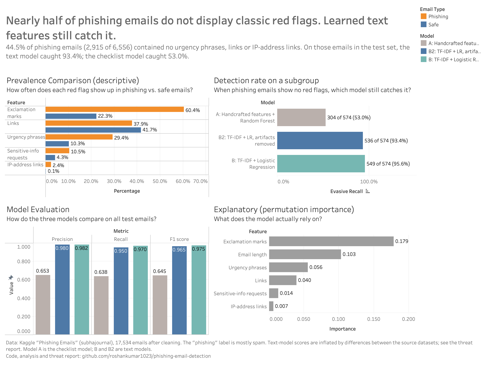

# Phishing Email Detection: Checklist vs. Full Text

Can a computer spot phishing by checking a short list of warning signs, or does it need to read the whole email? This project tests both approaches on a public dataset of 17,534 labeled emails (37% phishing, 63% safe) and compares them on the same set of emails that neither model saw during training.

- **The checklist model** scores each email on six measurements chosen in advance: exclamation marks, links, urgency phrases (like "verify" or "act now"), requests for sensitive information (like "password"), links to a raw IP address, and email length. A Random Forest then learns how much weight each measurement deserves. The technical term for measurements like these is "handcrafted features."
- **The text model** reads the words of each email and learns for itself which ones matter, using a standard method called TF-IDF with Logistic Regression.

Beyond the scores, the project asks three questions: how much phishing has none of the classic warning signs, how many of those emails each model still catches, and whether the text model is learning phishing language or just fingerprints of where the emails came from.

A note on the data: the dataset's "phishing" label covers both credential phishing and general spam, and most of it is spam. "Phishing" in this project means that label.

## Dashboard


## Approach

| Step | What was done | Why |
|---|---|---|
| Cleaning | Dropped nulls, blank/"empty" placeholder text, exact duplicates, and one corrupted 17M-character record, all **before** splitting | So no email can appear in both training and test data |
| Checklist measurements | 6 measurements from lowercased text; URL patterns tolerate spaced-out links (`http : / / ...`) | Represent the red flags a security analyst would look for |
| SQL analysis | SQLite database of labels + measurements; class summary, top-5% risk ranking (CTE + `NTILE`), evasive-phishing count | Answer the same questions the way a SOC or analytics team would |
| Checklist model (A) | The six checklist measurements + Random Forest | Baseline built on the classic red flags |
| Text model before removing source fingerprints (B) | TF-IDF (unigrams + bigrams) + Logistic Regression in a `Pipeline` | Learn which words matter directly from the data |
| Text model (B2) | The same model retrained with corpus artifacts (e.g. "enron", staff names, years) removed | Test whether the text model learns phishing language or dataset fingerprints |
| Evaluation | One shared stratified 80/20 split; precision, recall, F1, confusion matrix, 5-fold CV F1 (mean ± std) | A fair comparison that doesn't rely on accuracy alone |
| Evasive phishing | Phishing with no urgency phrases, no links and no IP links; recall of each model on these emails | Measure what happens when the classic red flags are absent |

## Key Findings

- **44.5% of phishing emails had none of the classic red flags.** 2,915 of 6,556 contained no urgency phrases, no links and no IP-address links. Any detection approach that depends on those signals is blind to nearly half the threat.
- **The text model caught what red flags miss.** On the 574 red-flag-free phishing emails in the test set, the text model caught 93.4% (536), compared with 53.0% (304) for the checklist model.
- **The text model outperformed the checklist model overall.** F1 of 0.965 vs. 0.645, with 66 missed phishing emails vs. 475, and 25 false alarms vs. 445, on the same 3,507 test emails.
- **Exclamation marks mattered more than urgency language.** In the checklist model, shuffling exclamation counts dropped test F1 by 0.178, more than three times the drop for urgency phrases (0.056). IP-address links were the most lopsided signal (2.41% of phishing vs. 0.05% of safe emails) but appeared too rarely to carry much weight.
- Limitations: the "phishing" class is mostly general spam (top terms: click, free, money), not credential theft, and the safe emails come largely from one company's early-2000s inbox and academic mailing lists. The text model partly learned to recognize those sources ("enron", staff names, years). Removing those fingerprints cost one point of F1 (0.975 → 0.965), but topic and formatting differences remain, so real-world performance on modern email would likely be lower.

**Model names.** This write-up uses plain names. The charts and CSV files use the technical labels.

| Plain name | Label in charts and files |
|---|---|
| Checklist model | A: Handcrafted features + Random Forest |
| Text model | B2: TF-IDF + LR, artifacts removed |
| Text model before removing source fingerprints | B: TF-IDF + Logistic Regression |

## Tech Stack

- Python 3.9 (pandas 1.4, NumPy 1.21, scikit-learn 1.0, Matplotlib 3.5)
- SQLite 3.39 
- Jupyter Notebook
- Tableau (dashboard built from `results/*.csv`)

## Repository Structure

```
phishing-email-detection/
├── data/                      
│   ├── phishing_emails.csv
│   └── phishing.db
├── notebooks/
│   └── analysis.ipynb         
├── queries/
│   └── analysis.sql           
├── results/                   
├── dashboard/                 
├── reports/                   
└── README.md
```

## How to Reproduce

1. Download the dataset from Kaggle: [Phishing Emails](https://www.kaggle.com/datasets/subhajournal/phishingemails), and save it as `data/phishing_emails.csv`.
2. Install Python 3.9 with pandas, NumPy, scikit-learn, Matplotlib and Jupyter (the Anaconda distribution includes all of them).
3. Run the notebook from top to bottom, either in Jupyter (Kernel → Restart & Run All) or from the command line:
   ```bash
   jupyter nbconvert --to notebook --execute --inplace notebooks/analysis.ipynb
   ```
   This creates `data/phishing.db` and writes everything in `results/` and `dashboard/`. A full run takes a few minutes.

