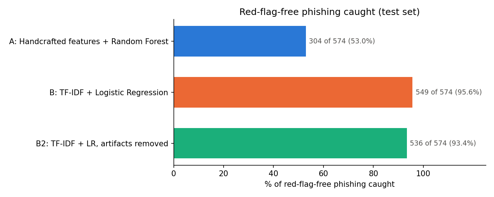
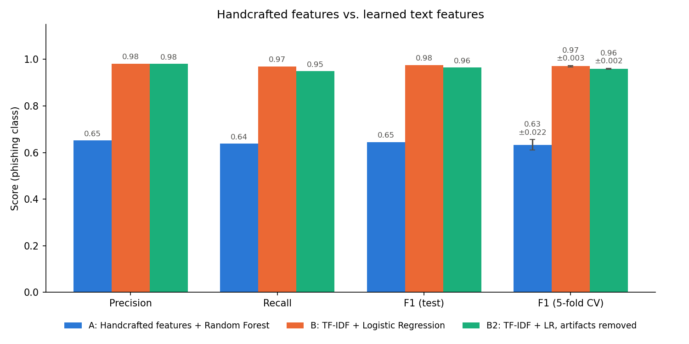
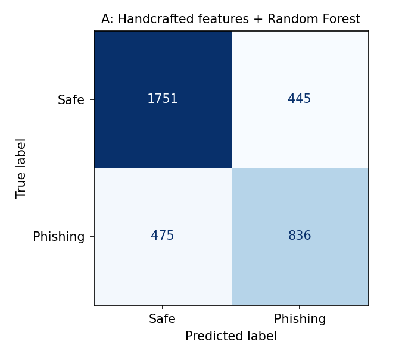
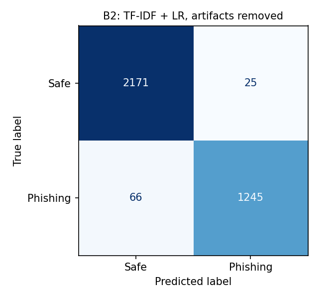

# Threat Report: Phishing That Evades Red-Flag Detection

- Analyst: Roshan Kumar
- Date: October 7, 2026
- Dataset: [Phishing Emails](https://www.kaggle.com/datasets/subhajournal/phishingemails) (Kaggle), 18,650 labeled emails; 17,534 after cleaning (6,556 phishing / 10,978 safe)
- Evaluation: one stratified 80/20 split, 3,507 test emails (1,311 phishing / 2,196 safe), plus 5-fold cross-validation on the training set

In this dataset, "phishing" is the source label. It covers credential phishing and general spam alike, and most of it is spam. See Limitations.

---

## Executive Summary

Nearly half of the phishing in this dataset has none of the usual warning signs. Of 6,556 phishing emails, 2,915 (44.5%) contain no urgency phrases, no links and no links to raw IP addresses.

I compared two ways of catching phishing on the same held-out test emails. The checklist model scores each email on six measurements chosen in advance (exclamation marks, links, urgency phrases, requests for sensitive information, IP-address links and length). The text model reads the words of the email itself. Among the 574 test phishing emails with none of the usual warning signs, the text model caught 93.4% and the checklist model caught 53.0%.

Across all 1,311 phishing emails in the test set, the text model caught 95.0% and missed 66, while the checklist model caught 63.8% and missed 475. The text model also raised far fewer false alarms: 25 safe emails flagged, against 445 for the checklist model.

The text model's scores are inflated by differences between the sources of the safe and phishing emails, so real-world performance on modern email would be lower. The gap between the two approaches is the reliable finding, because both were tested on the same emails.

**Model names.** This write-up uses plain names. The charts and CSV files use the technical labels.

| Plain name | Label in charts and files |
|---|---|
| Checklist model | A: Handcrafted features + Random Forest |
| Text model | B2: TF-IDF + LR, artifacts removed |
| Text model before removing source fingerprints | B: TF-IDF + Logistic Regression |

The technical term for the checklist model's six measurements is "handcrafted features."

---

## Key Findings

### 1. Classic red flags are absent from most phishing

| Red flag | Phishing emails with it | Safe emails with it |
|---|---|---|
| Exclamation marks | 60.4% | 22.3% |
| Links | 37.9% | 41.7% |
| Urgency phrases ("verify", "suspend", "action required") | 29.4% | 10.3% |
| Requests for sensitive information ("password", "wire transfer") | 10.5% | 4.3% |
| Links to a raw IP address | 2.41% | 0.05% |

Every red flag is more common in phishing except links, which appear slightly more often in safe email. But no single flag appears in more than about 60% of phishing. Urgency language, the signal most associated with phishing, appears in fewer than a third of phishing emails.

### 2. 44.5% of phishing has none of the urgency, link or IP-link flags

2,915 of 6,556 phishing emails have zero urgency phrases, zero links and zero IP-address links. In the test set, the share is 43.8% (574 of 1,311). These emails are invisible to any filter that depends on those three signals.

| Model | Red-flag-free phishing caught (test set) |
|---|---|
| Checklist model | 304 of 574 (53.0%) |
| Text model | 536 of 574 (93.4%) |

The checklist model still catches about half of them because its six measurements include exclamation marks and email length, which are not part of the "no warning signs" definition. The text model recognizes them from their wording.

### 3. The text model outperforms the checklist model

| Model | Precision | Recall | F1 | 5-fold CV F1 | Phishing caught | Missed | False alarms |
|---|---|---|---|---|---|---|---|
| Checklist model (A) | 0.653 | 0.638 | 0.645 | 0.633 ± 0.022 | 836 | 475 | 445 |
| Text model before removing source fingerprints (B) | 0.981 | 0.969 | 0.975 | 0.971 ± 0.003 | 1,271 | 40 | 24 |
| Text model (B2) | 0.980 | 0.950 | 0.965 | 0.959 ± 0.002 | 1,245 | 66 | 25 |

Confusion matrices: the checklist model (A, first) vs the text model (B2, second).

The checklist model would be hard to operate: it flags 445 of 2,196 safe test emails (20%) and still lets 475 phishing emails through. The text model flags 25 safe emails (1.1%) and misses 66 phishing emails (5.0%). The small spread across cross-validation folds (± 0.002 for the text model) shows the result is stable, not a lucky split.

Accuracy is not used to compare models: 62.6% of test emails are safe, so a model that never flags anything would score 62.6%.

### 4. Exclamation marks matter more than urgency language

Permutation importance measures how much the checklist model's test F1 drops when one feature is shuffled.

| Measurement | Drop in test F1 when shuffled |
|---|---|
| Exclamation marks | 0.178 |
| Email length | 0.103 |
| Urgency phrases | 0.056 |
| Links | 0.040 |
| Requests for sensitive information | 0.013 |
| IP-address links | 0.007 |

Exclamation marks carry more than three times the weight of urgency phrases. IP-address links are the most lopsided signal in the data, appearing in phishing roughly 50 times as often as in safe email, yet they matter least to the model because they appear in only 2.41% of phishing.

### 5. The text model partly learned where emails came from

Of the top 20 words pushing the text model before removing source fingerprints toward "safe", 9 are fingerprints of the source data rather than signs of legitimacy: "enron", staff names, the area code 713, and the years 2000 to 2002. "enron" alone appears in 2,239 safe emails and 1 phishing email. Three of the top 20 phishing words are also fingerprints, including the years 2004 and 2005.

The text model is the same model with these tokens removed. F1 fell only from 0.975 to 0.965 and missed phishing rose from 40 to 66, so the fingerprints explain only a small part of the score. However, the text model's top safe terms still include email formatting ("date", "pm", "cc", "forwarded") and the topics of the source mailing lists ("linguistics", "university", "linux"). The model is still partly separating these specific sources, not only phishing from legitimate mail.

---

## Recommendations

1. **Do not rely on red-flag rules alone.** 44.5% of phishing in this dataset carries none of the urgency, link or IP-link signals these rules depend on. Treat rules as one input, not the whole filter.
2. **Keep IP-address links as a high-precision rule.** They appear in 2.41% of phishing and 0.05% of safe email. A rule on this signal will rarely be wrong, even though it catches little on its own.
3. **Layer a text model behind the rules** to cover phishing that carries no red flags. In this analysis it raised detection of red-flag-free phishing from 53.0% to 93.4%.
4. **Validate on current, real email before trusting any score.** This dataset's scores are inflated by source differences. Before deployment, test on a recent sample of the organization's own mail and set expectations from that result.
5. **Add signals that email body text cannot provide.** Sender and display-name mismatches, lookalike domains, SPF/DKIM/DMARC results and URL reputation address impersonation and credential phishing, which this dataset under-represents.
6. **Retrain on a schedule.** Phishing wording changes quickly. A model trained once will drift as attackers adapt.

---

## Limitations

- **"Phishing" here is mostly spam.** The strongest phishing words are "click", "free" and "money", and pharmacy terms such as "viagra" and "meds" also rank highly. There is little credential-theft language such as "verify your account". The results describe spam and phishing together, not targeted credential phishing.
- **Source differences inflate the text model.** Safe emails come largely from Enron's early-2000s inbox and academic or technical mailing lists. Removing obvious fingerprints did not remove topic and formatting differences, so the text model's 0.965 F1 overstates likely real-world performance.
- **The emails are old.** Most appear to date from the early-to-mid 2000s; years from 2000 to 2005 rank among the model's top terms. Modern phishing uses HTML layouts, brand impersonation, QR codes and AI-written text that this dataset does not contain.
- **Body text only.** No headers, sender addresses, link destinations or attachments were analyzed.
- **"Red-flag-free" depends on my definition.** It means no urgency phrases, links or IP links as measured by my own patterns. A broader list of red flags would produce a smaller share.
- **Phrase counts can be inflated by repetition.** One email scored 57 urgency phrases. This is why the SQL top-5% risk ranking is a way to inspect keyword-heavy phishing, not a reliable risk ranking.
- **Only exact duplicates were removed.** Near-identical template emails with small differences could appear in both training and test data, which would inflate both models' scores.
- **No adversarial testing or threshold tuning.** Both models use their default decision thresholds, and neither was tested against emails written to evade them.

---

*All figures are generated by `notebooks/analysis.ipynb` and listed in `results/metrics_summary.md`.*
